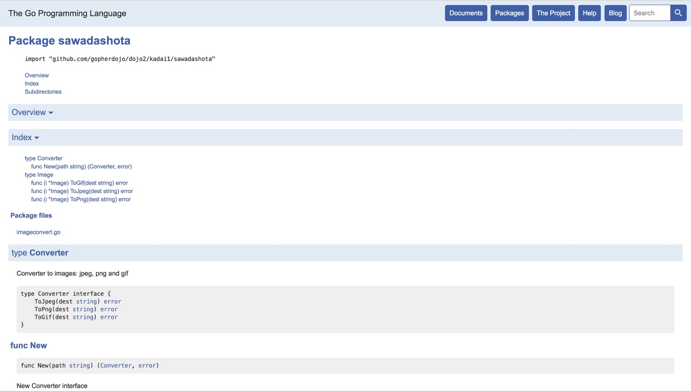

kadai1 sawadashota
===

JPEG、PNG、GIFの相互変換をするコマンド。

Usage
---

```
go run cmd/main.go [-f jpg|png|gif] [-t jpg|png|gif] path...
```


### Options

* `-f` 変換対象の画像形式。`jpg`、`png`、`gif`のいずれかを指定する（デフォルトは`jpg`）
* `-t` 変換後の画像形式。`jpg`、`png`、`gif`のいずれかを指定する（デフォルトは`png`）

課題の回答
---

### ディレクトリを指定する

`flag.Args()`で受け取る値を対象のディレクトリとしました。与件にはありませんでしたが、複数指定できるようにしました。

### ディレクトリ以下は再帰的に処理する

対象ディレクトリから、対象の画像形式の画像パスを返す関数を`main`パッケージの`targetImages(dir string, r *regexp.Regexp) []string`に実装しました。

引数に`*regexp.Regexp`を持つのは、画像の拡張子を正規表現で渡すためです。

### 指定したディレクトリ以下のJPGファイルをPNGに変換

オプションを指定しなかった場合はJPGからPNGに変換するようにしました。

> 変換前と変換後の画像形式を指定できる

変換対象の画像形式と変換後の画像形式をオプションで指定できるようにしました。JPG、PNG、GIFの3つから選択できます。

### mainパッケージと分離する

`main`パッケージは`cmd`ディレクトリに配置しました。

### 自作パッケージと標準パッケージと準標準パッケージのみ使う

### ユーザ定義型を作ってみる

画像のユーザ定義型を作ってみました。

```go
type Image struct {
	Src image.Image
}
```

この画像型をレシーバとして`func (i *Image) ToJpeg(dest string) error`などの関数を作成しました。

### GoDocを生成してみる

以下のコマンドで生成しました。

```
godoc -http :6060
```


